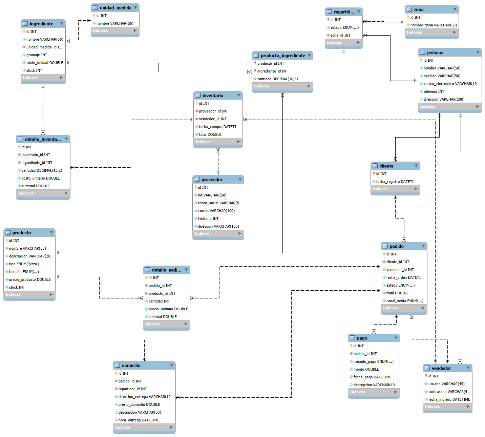

### Sistema de Gestion de Base de Datos Pizzeria Don Piccolo 

<p align="center">
  
  
  
</p>

Este proyecto es un sistema de gestión de base de datos para la pizzería "Don Piccolo". Está diseñado para manejar y organizar la información relacionada con los clientes, pedidos, productos y empleados de la pizzería.

## Características
- Gestión de clientes: Registro y seguimiento de la información de los clientes.
- Gestión de pedidos: Registro y seguimiento de los pedidos realizados por los clientes.
- Gestión de productos: Registro y seguimiento de los productos disponibles en el menú.
- Gestión de empleados: Registro y seguimiento de la información de los empleados.
- Consultas SQL para obtener información relevante sobre ventas, clientes y productos.
## Tecnologías Utilizadas
- MySQL: Sistema de gestión de bases de datos relacional utilizado para almacenar y gestionar los
datos de la pizzería.
- SQL: Lenguaje de consulta estructurado utilizado para interactuar con la base de datos.
## Instalación
1. Clona este repositorio en tu máquina local.

    ```bash
    git clone https://github.com/angeldavila00/Sistema_Gestion_Pizzeria_NinoAngel.git
    ```
2. Asegúrate de tener MySQL instalado en tu máquina.
3. Importa el archivo SQL proporcionado en este repositorio para crear la base de datos y las tablas necesarias.
4. Configura la conexión a la base de datos en tu entorno de desarrollo.


    ```bash
    mysql -u tu_usuario -p < pizzeria_don_piccolo.sql
    ```


### Funcionalidades principales gestionadas:

- **Cliente**: registro y mantenimiento de información personal, direcciones de entrega y historial de pedidos.
- **Pizza e ingrediente**: catálogo de pizzas, gestión de ingredientes y relación muchos a muchos entre pizzas e ingredientes (personalización).
- **Pedido**: creación de pedidos, detalles de los ítems solicitados, estados del pedido (recibido, en preparación, en camino, entregado, etc.).
- **Pago**: registro de pagos asociados a pedidos, métodos de pago y montos.
- **Domicilio**: gestión de entregas a domicilio con asignación de repartidores y seguimiento del estado de entrega.
- **Inventario**: control de stock de ingredientes, actualización automática al preparar pizzas y alertas de bajo inventario.
- **Automatización y métricas**: implementación de vistas, funciones, procedimientos almacenados y triggers para:
  - Automatizar procesos (actualización de inventario, cambio de estados, cálculo de totales).
  - Generar reportes y métricas clave del negocio (ventas por período, pizzas más vendidas, ingresos por repartidor, etc.).

## 2. Características Principales

- Herencia de personas: clientes, vendedores y repartidores comparten la tabla `persona`
- Relación muchos a muchos entre productos (pizzas) e ingredientes
- Control de stock automático (próximo a implementarse con triggers)
- Gestión de zonas y disponibilidad de repartidores
- Registro detallado de compras a proveedores y detalle de ingredientes adquiridos
- Soporte para múltiples canales de venta
- Historial completo de pedidos, domicilios y pagos

## 3. Tecnologías Utilizadas

- **SGBD**: MySQL 8.0+ / MariaDB
- **Lenguaje**: SQL puro
- **Modelo**: Relacional (normalizado hasta 3NF)
- **Herramientas recomendadas**: MySQL Workbench, phpMyAdmin, DBeaver

## 4. Diagrama de Entidades y Relaciones (ER)



## 5. Estructura de la Base de Datos

### Tablas principales (18 tablas):

| Tabla                  | Descripción                                      |
|------------------------|--------------------------------------------------|
| `persona`              | Datos comunes de personas (clientes, empleados)  |
| `cliente`              | Clientes registrados                             |
| `vendedor`             | Cajeros/vendedores con credenciales              |
| `repartidor`           | Repartidores con zona y estado de disponibilidad |
| `zona`                 | Zonas de cobertura de domicilios                 |
| `unidad_medida`        | gramos, unidades, litros, etc.                   |
| `ingrediente`          | Ingredientes con stock y costo                   |
| `producto`             | Pizzas por tamaño (solo tipo 'pizza' por ahora)  |
| `producto_ingrediente` | Composición de cada pizza                        |
| `proveedor`            | Proveedores de insumos                           |
| `inventario`           | Compras realizadas a proveedores                 |
| `detalle_inventario`   | Items comprados en cada factura                  |
| `pedido`               | Pedidos con estado, canal y total                |
| `detalle_pedido`       | Productos incluidos en cada pedido               |
| `domicilio`            | Entregas a domicilio con repartidor asignado     |
| `pago`                 | Pagos asociados a cada pedido                    |

# Consultas SQL Avanzadas - Sistema de Pizzería 

Base de datos para gestión de pedidos, clientes, repartidores, productos y entregas a domicilio.

A continuación se presentan 7 procedimientos almacenados (stored procedures) en MySQL que cubren los requerimientos más comunes del negocio.

---

# Procedimientos Almacenados - Pizzería (MySQL)

Nombres oficiales de las 7 consultas requeridas:

1. `clientes_pedidos_entre_fechas`  
   → Clientes con pedidos entre dos fechas (BETWEEN)

2. `pizzas_mas_vendidas`  
   → Pizzas más vendidas (GROUP BY + COUNT)

3. `pedidos_por_repartidor`  
   → Pedidos entregados por repartidor (JOIN + GROUP BY)

4. `promedio_entrega_por_zona`  
   → Promedio de tiempo de entrega por zona (AVG + JOIN)

5. `clientes_que_gastaron_mas_de`  
   → Clientes que gastaron más de un monto (HAVING)

6. `busqueda_pizza_por_nombre`  
   → Búsqueda por coincidencia parcial de nombre de pizza (LIKE)

7. `clientes_frecuentes`  
   → Clientes con más de 5 pedidos mensuales (subconsulta + HAVING por mes)

## Licencia
Este proyecto está bajo la Licencia MIT. Consulta el archivo LICENSE para más detalles.